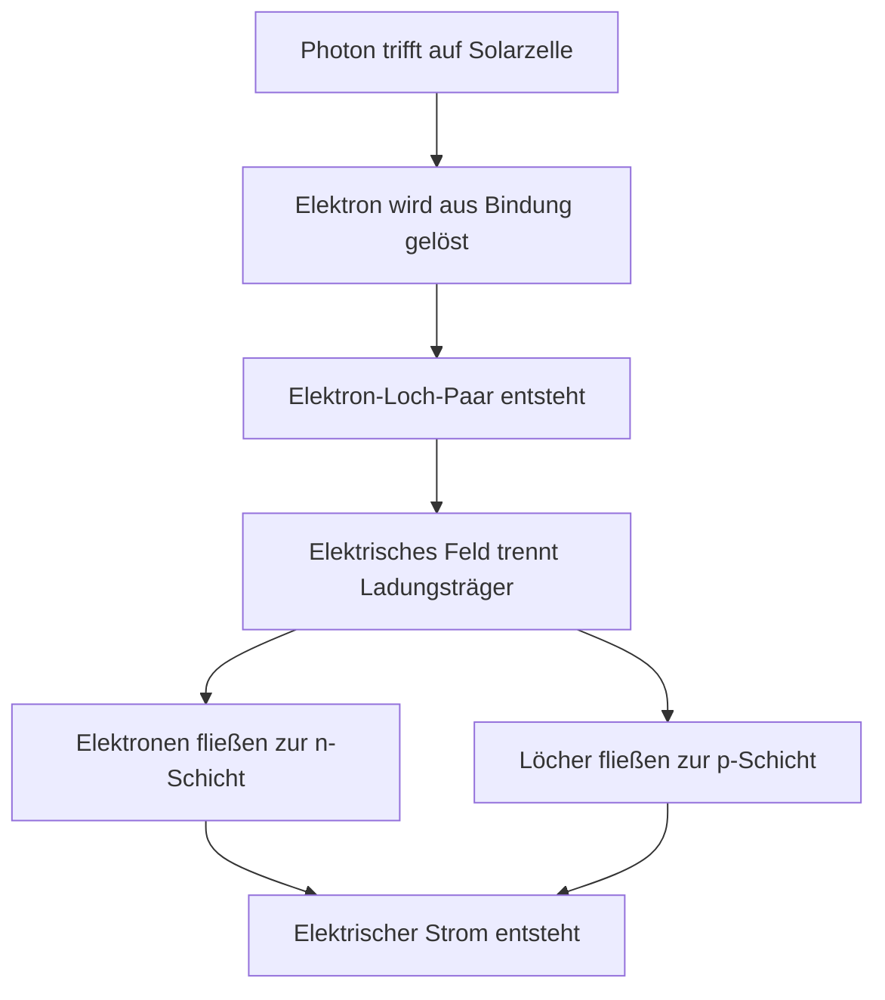

<!--
author: Fotovoltaik Kurs
email: kurs@fotovoltaik.de
version: 1.0.0
language: de
narrator: Deutsch Female
comment: Einführung in die Fotovoltaik für Studierende im ersten Studienjahr

logo: https://upload.wikimedia.org/wikipedia/commons/thumb/f/f5/Photovoltaic_cell_symbol.svg/200px-Photovoltaic_cell_symbol.svg.png

script: https://cdn.jsdelivr.net/npm/mermaid@10.6.1/dist/mermaid.min.js

-->

# Fotovoltaik - Einführung und Übersicht

                          --{{0}}--
Herzlich willkommen zu diesem Selbstlernkurs über Fotovoltaik! In diesem Kurs lernen Sie die Grundlagen der Fotovoltaik kennen - eine der wichtigsten erneuerbaren Energietechnologien unserer Zeit. Sie werden verstehen, wie Solarzellen funktionieren, welche Arten es gibt und wo sie eingesetzt werden.


## Lernziele

Nach Abschluss dieses Kurses können Sie:

- **Erklären**, was Fotovoltaik ist und wie sie funktioniert
- **Beschreiben** die grundlegenden physikalischen Prinzipien
- **Unterscheiden** zwischen verschiedenen Solarzelltypen
- **Einschätzen** die Bedeutung der Fotovoltaik für die Energiewende
- **Identifizieren** typische Anwendungsgebiete

---

## 1. Was ist Fotovoltaik?

                          --{{0}}--
Fotovoltaik, auch Photovoltaik genannt, ist die direkte Umwandlung von Sonnenlicht in elektrische Energie. Der Begriff setzt sich aus den Wörtern "Photos" (griechisch für Licht) und "Volta" (nach Alessandro Volta, dem Erfinder der Batterie) zusammen.

### Definition und Grundprinzip

**Fotovoltaik** ist die Umwandlung von Lichtenergie, meist Sonnenlicht, in elektrische Energie mittels Solarzellen.

Das Grundprinzip basiert auf dem **photovoltaischen Effekt**, der bereits 1839 von Alexandre Edmond Becquerel entdeckt wurde.

?[Wie funktioniert eine Solarzelle?](https://www.youtube.com/watch?v=xKxrkht7CpY "Creative Commons Video zur Funktionsweise von Solarzellen")

### Der photovoltaische Effekt

                          --{{1}}--
Wenn Lichtteilchen, sogenannte Photonen, auf eine Solarzelle treffen, können sie Elektronen aus ihren Bindungen lösen und somit elektrischen Strom erzeugen. Dieser Prozess findet hauptsächlich in Halbleitermaterialien wie Silizium statt.

{{1}}
```ascii
    Sonnenlicht (Photonen)
           ↓
    ┌─────────────────┐
    │   Solarzelle    │
    │  (Halbleiter)   │ → Gleichstrom (DC)
    │                 │
    └─────────────────┘
           ↓
    Elektrischer Strom
```

### Quiz: Grundverständnis

                          --{{2}}--
Testen Sie Ihr Grundverständnis mit dieser ersten Frage:

{{2}}
Was bedeutet der Begriff "Fotovoltaik"?

[( )] Umwandlung von Wärme in Strom
[(X)] Umwandlung von Licht in Strom
[( )] Umwandlung von Wind in Strom
[( )] Speicherung von Sonnenenergie

---

## 2. Geschichte der Fotovoltaik

                          --{{0}}--
Die Entwicklung der Fotovoltaik ist eine faszinierende Geschichte von wissenschaftlichen Entdeckungen und technologischen Durchbrüchen.

### Wichtige Meilensteine

| Jahr | Ereignis | Bedeutung |
|------|----------|-----------|
| **1839** | A. E. Becquerel entdeckt den photovoltaischen Effekt | Grundlage der Fotovoltaik |
| **1883** | Charles Fritts baut erste Solarzelle (Selen) | Wirkungsgrad: 1% |
| **1954** | Bell Laboratories: erste Silizium-Solarzelle | Wirkungsgrad: 6% |
| **1958** | Erste Satelliten mit Solarzellen (Vanguard 1) | Weltraumanwendung |
| **1973** | Ölkrise fördert erneuerbare Energien | Kommerzielle Entwicklung |
| **2000er** | Massenproduktion und Kostensenkung | Durchbruch am Markt |

### Praktisches Beispiel: Vanguard 1

                          --{{1}}--
Der Satellit Vanguard 1 war 1958 einer der ersten praktischen Anwendungen der Fotovoltaik. Er sendete dank seiner Solarzellen über 6 Jahre lang Daten zur Erde - länger als jeder andere Satellit dieser Zeit!

{{1}}


### Multiple-Choice Quiz: Geschichte

                          --{{2}}--
Mehrere Antworten können richtig sein:

{{2}}
Welche Aussagen zur Geschichte der Fotovoltaik sind korrekt?

[[X]] Der photovoltaische Effekt wurde im 19. Jahrhundert entdeckt
[[ ]] Die erste Solarzelle wurde aus Kupfer hergestellt  
[[X]] Die Raumfahrt war ein wichtiger Treiber für die Entwicklung
[[X]] Die Ölkrise 1973 verstärkte das Interesse an Solarenergie
[[ ]] Moderne Solarzellen erreichen bereits über 50% Wirkungsgrad

---

## 3. Physikalische Grundlagen

                          --{{0}}--
Um die Fotovoltaik zu verstehen, müssen wir uns die physikalischen Vorgänge in einer Solarzelle genauer ansehen.

### Halbleiter und Dotierung

**Halbleiter** sind Materialien, deren elektrische Leitfähigkeit zwischen der von Leitern und Isolatoren liegt.

Reines Silizium ist bei Raumtemperatur ein schlechter Leiter. Durch **Dotierung** - das gezielte Einbringen von Fremdatomen - wird es leitfähiger:

- **n-Dotierung**: Zugabe von Phosphor (5 Valenzelektronen)
- **p-Dotierung**: Zugabe von Bor (3 Valenzelektronen)

### Der p-n-Übergang

                          --{{1}}--
Wenn p-dotierte und n-dotierte Schichten aufeinandertreffen, entsteht ein p-n-Übergang. Hier bildet sich ein elektrisches Feld, das für die Fotovoltaik entscheidend ist.

{{1}}


### Praktisches Beispiel: Wirkungsgrad

Ein typisches **Beispiel** für moderne Silizium-Solarzellen:

- **Monokristallines Silizium**: 20-22% Wirkungsgrad
- **Polykristallines Silizium**: 15-18% Wirkungsgrad  
- **Dünnschicht (a-Si)**: 6-8% Wirkungsgrad

Das bedeutet: Von 1000 W/m² Sonnenlicht werden etwa 200W/m² in elektrische Energie umgewandelt.

### Single-Choice Quiz: Physik

                          --{{2}}--
Eine wichtige Frage zum physikalischen Verständnis:

{{2}}
Was passiert, wenn ein Photon auf eine Solarzelle trifft?

[( )] Es wird reflektiert
[( )] Es erwärmt die Zelle
[(X)] Es löst ein Elektron aus der Bindung
[( )] Es zerstört die Zellstruktur

---

## 4. Arten von Solarzellen

                          --{{0}}--
Es gibt verschiedene Typen von Solarzellen, die sich in Material, Herstellung und Eigenschaften unterscheiden.

### Silizium-basierte Solarzellen

#### Monokristallines Silizium
- **Wirkungsgrad**: 20-22%
- **Eigenschaften**: Hohe Effizienz, hohe Kosten
- **Erkennungsmerkmal**: Gleichmäßig dunkelblaue bis schwarze Farbe
- **Anwendung**: Premium-Anlagen, begrenzter Platz

#### Polykristallines Silizium  
- **Wirkungsgrad**: 15-18%
- **Eigenschaften**: Guter Kompromiss aus Kosten und Effizienz
- **Erkennungsmerkmal**: Bläulich schimmernde, kristalline Struktur
- **Anwendung**: Standard-Wohnanlagen

### Dünnschicht-Technologien

                          --{{1}}--
Dünnschicht-Solarzellen sind nur wenige Mikrometer dick und können auf flexible Substrate aufgebracht werden.

{{1}}
#### Amorphes Silizium (a-Si)
- **Wirkungsgrad**: 6-8%
- **Vorteil**: Flexibel, funktioniert bei diffusem Licht
- **Anwendung**: Taschenrechner, kleine Geräte

#### Cadmium-Tellurid (CdTe)
- **Wirkungsgrad**: 9-11%
- **Vorteil**: Niedrige Produktionskosten
- **Nachteil**: Cadmium ist toxisch

#### Kupfer-Indium-Gallium-Selenid (CIGS)
- **Wirkungsgrad**: 12-14%
- **Vorteil**: Flexibel, gute Performance bei hohen Temperaturen

### Vergleichsübersicht

                          --{{2}}--
Hier eine praktische Übersicht der wichtigsten Solarzelltypen:

{{2}}
| Typ | Wirkungsgrad | Kosten | Besonderheit |
|-----|-------------|---------|--------------|
| **Monokristallin** | 20-22% | Hoch | Höchste Effizienz |
| **Polykristallin** | 15-18% | Mittel | Bester Kompromiss |
| **Dünnschicht** | 6-14% | Niedrig | Flexibel einsetzbar |

### Multiple-Choice Quiz: Solarzelltypen

                          --{{3}}--
Welche Aussagen über Solarzelltypen sind richtig?

{{3}}
[[X]] Monokristalline Zellen haben den höchsten Wirkungsgrad
[[ ]] Dünnschichtzellen sind immer besser als kristalline Zellen
[[X]] Polykristalline Zellen bieten einen guten Kosten-Nutzen-Kompromiss
[[X]] CdTe-Zellen enthalten toxisches Cadmium
[[ ]] Alle Solarzellen bestehen aus Silizium

---

## 5. Anwendungsgebiete

                          --{{0}}--
Fotovoltaik findet heute in vielen Bereichen Anwendung - von kleinen Geräten bis hin zu riesigen Solarparks.

### Gebäudeintegrierte Fotovoltaik (BIPV)

                          --{{1}}--
Solar modules können direkt in Gebäude integriert werden und dabei architektonische Funktionen übernehmen.

{{1}}
**Beispiele für BIPV:**
- **Solardächer**: Ersatz für herkömmliche Dachziegel
- **Solarfassaden**: Integration in die Gebäudehülle  
- **Solarfenster**: Teiltransparente Module
- **Solarmarkisen**: Gleichzeitiger Sonnen- und Energieschutz

?[Gebäudeintegrierte Photovoltaik](https://www.youtube.com/watch?v=6YVtLx1aq2E "Beispiele für BIPV-Systeme")

### Freiflächenanlagen

Große Solarparks auf freien Flächen können erhebliche Mengen an Strom erzeugen.

**Größte Solarparks der Welt (Beispiele):**
- **Noor Abu Dhabi** (VAE): 1.177 MW
- **Tengger Desert Solar Park** (China): 1.547 MW
- **Mohammed bin Rashid Al Maktoum Solar Park** (VAE): geplant 5.000 MW

### Spezialanwendungen

                          --{{2}}--
Fotovoltaik hat auch viele spezialisierte Einsatzgebiete gefunden.

{{2}}
#### Mobile Anwendungen
- **Wohnmobile/Boote**: Autonome Stromversorgung
- **Elektrofahrzeuge**: Zusätzliche Reichweite
- **Outdoor-Ausrüstung**: Powerbanks, Ladegeräte

#### Netzunabhängige Systeme (Off-Grid)
- **Entwicklungsländer**: Elektrifizierung abgelegener Gebiete
- **Telekommunikation**: Versorgung von Sendemasten
- **Landwirtschaft**: Bewässerungspumpen

#### Raumfahrt
- **Satelliten**: Primäre Energiequelle
- **Raumstationen**: ISS nutzt 262.000 Solarzellen
- **Mars-Rover**: Energieversorgung auf anderen Planeten

### Praxisbeispiel: Eigenheim

Ein typisches **Einfamilienhaus** in Deutschland:
- **Dachfläche**: 40 m²
- **Installierte Leistung**: 8 kWp
- **Jährlicher Ertrag**: ~7.200 kWh
- **Eigenverbrauch**: ~3.500 kWh/Jahr
- **CO₂-Einsparung**: ~3,6 Tonnen/Jahr

### Single-Choice Quiz: Anwendungen

                          --{{3}}--
In welchem Bereich wurde Fotovoltaik ZUERST kommerziell eingesetzt?

{{3}}
[( )] Wohngebäude
[( )] Industrieanlagen
[(X)] Raumfahrt
[( )] Taschenrechner

---

## 6. Bedeutung für die Energiewende

                          --{{0}}--
Fotovoltaik spielt eine zentrale Rolle bei der Transformation unseres Energiesystems hin zu erneuerbaren Energien.

### Globale Entwicklung

Die Fotovoltaik verzeichnet weltweit ein enormes Wachstum:

- **2010**: 40 GW installierte Leistung weltweit
- **2020**: 760 GW installierte Leistung weltweit
- **2023**: über 1.400 GW installierte Leistung weltweit

Das entspricht einer **Verdopplung etwa alle 3-4 Jahre**!

### Kostenverfügung

                          --{{1}}--
Ein entscheidender Faktor für den Erfolg der Fotovoltaik war die dramatische Kostensenkung.

{{1}}
**Preisentwicklung Solarmodule:**
- **1980**: ~20 $/Wp
- **2000**: ~3,50 $/Wp  
- **2010**: ~1,50 $/Wp
- **2020**: ~0,20 $/Wp
- **2024**: ~0,15 $/Wp

Das ist eine **Kostensenkung um 99%** in 40 Jahren!

### Umweltvorteile

**CO₂-Bilanz einer Solaranlage:**
- **Energetische Amortisation**: 1-4 Jahre
- **Lebensdauer**: 25-30 Jahre
- **CO₂-Vermeidung**: 20-50 g/kWh (vs. 820 g/kWh bei Braunkohle)

### Herausforderungen

                          --{{2}}--
Trotz aller Vorteile gibt es noch Herausforderungen zu bewältigen:

{{2}}
- **Schwankende Erzeugung**: Abhängigkeit von Wetter und Tageszeit
- **Speicherbedarf**: Batterien für Eigenverbrauch und Netzstabilität
- **Netzintegration**: Intelligente Netze (Smart Grid) erforderlich
- **Flächenbedarf**: Konkurrenz mit anderen Landnutzungen
- **Recycling**: Ende-of-Life Management für Solarmodule

### Deutschland als Beispiel

**Fotovoltaik in Deutschland (2024):**
- **Installierte Leistung**: ~82 GW
- **Anteil am Strommix**: ~12%
- **Installierte Systeme**: >3 Millionen
- **Arbeitsplätze**: ~180.000

### Multiple-Choice Quiz: Energiewende

                          --{{3}}--
Welche Faktoren haben zum Erfolg der Fotovoltaik beigetragen?

{{3}}
[[X]] Drastische Kostensenkung der Solarmodule
[[X]] Politische Förderung (z.B. EEG in Deutschland)
[[ ]] Steigende Preise für konventionelle Energie
[[X]] Technologische Verbesserungen beim Wirkungsgrad
[[X]] Wachsendes Umweltbewusstsein

---

## 7. Zusammenfassung und Ausblick

                          --{{0}}--
Fassen wir die wichtigsten Erkenntnisse dieses Kurses zusammen und werfen einen Blick in die Zukunft.

### Wichtigste Erkenntnisse

**Was haben Sie gelernt?**

1. **Fotovoltaik** wandelt Sonnenlicht direkt in elektrische Energie um
2. Der **photovoltaische Effekt** basiert auf Halbleitereigenschaften
3. **Verschiedene Solarzelltypen** haben unterschiedliche Vor- und Nachteile
4. **Anwendungen** reichen von kleinen Geräten bis zu Megawatt-Solarparks
5. **Kostensenkung** und **Effizienzsteigerung** treiben das Wachstum voran

### Zukunftsausblick

                          --{{1}}--
Die Zukunft der Fotovoltaik sieht vielversprechend aus. Hier einige spannende Entwicklungen:

{{1}}
#### Technologische Innovationen
- **Perowskit-Tandemzellen**: Potenzial für >30% Wirkungsgrad
- **Bifaziale Module**: Nutzen Licht von beiden Seiten
- **Schwimmende Solaranlagen** (Floating-PV): Schutz vor Verdunstung
- **Agri-PV**: Kombination von Landwirtschaft und Solarenergie

#### Neue Materialien
- **Organische Solarzellen**: Flexible, transparente Anwendungen
- **Quantenpunkte**: Höhere Effizienz bei verschiedenen Wellenlängen
- **Konzentrator-PV**: Sehr hohe Wirkungsgrade mit Linsen/Spiegeln

### Globales Potenzial

Die **Internationale Energieagentur (IEA)** schätzt:
- Fotovoltaik könnte bis 2050 **27%** des weltweiten Strombedarfs decken
- Weitere **Kostensenkungen** um 50-85% bis 2050 möglich
- **100 Millionen Arbeitsplätze** im Solarbereich bis 2030

### Abschluss-Quiz: Gesamtverständnis

                          --{{2}}--
Testen Sie Ihr Gesamtverständnis der Fotovoltaik:

{{2}}
Was sind die drei wichtigsten Vorteile der Fotovoltaik?

[[ ]] Hohe Energiedichte
[[X]] Umweltfreundlichkeit
[[ ]] Konstante Energieerzeugung
[[X]] Sinkende Kosten
[[X]] Dezentrale Erzeugung möglich
[[ ]] Einfache Speicherung

---

## 8. Weiterführende Ressourcen

                          --{{0}}--
Für das weitere Studium der Fotovoltaik empfehlen wir folgende Ressourcen:

### Empfohlene Videos (OER/CC-lizenziert)

1. ?[Solar Power Explained](https://www.youtube.com/watch?v=xKxrkht7CpY "Grundlagen der Solarenergie")
2. ?[How Solar Panels Work](https://www.youtube.com/watch?v=tlOv8aMyCDo "Detaillierte Funktionsweise")
3. ?[Types of Solar Cells](https://www.youtube.com/watch?v=Gg6vXoHO95I "Verschiedene Solarzelltypen")

### Weiterführende Literatur

- **"Solar Photovoltaic Technology"** - Fraunhofer ISE
- **"Photovoltaics: Devices, Systems and Applications"** - Markvart & Castañer
- **Renewable Energy World Magazine** - Aktuelle Entwicklungen

### Online-Ressourcen

- [Fraunhofer ISE](https://www.ise.fraunhofer.de) - Führendes Forschungsinstitut
- [IEA PVPS](https://iea-pvps.org) - Internationale Zusammenarbeit
- [pv magazine](https://www.pv-magazine.de) - Branchenmagazin

### Simulationstools

- **PVLib** (Python): Leistungsberechnung von PV-Systemen
- **SAM** (NREL): System Advisor Model
- **PVsyst**: Kommerzielle Planungssoftware

---

## Glossar

**Wichtige Begriffe der Fotovoltaik:**

| Begriff | Definition |
|---------|------------|
| **Photovoltaischer Effekt** | Direkte Umwandlung von Lichtenergie in elektrische Energie |
| **Wirkungsgrad** | Verhältnis von abgegebener zu eingestrahlter Energie |
| **kWp** | Kilowatt peak - Nennleistung unter Standardbedingungen |
| **Dotierung** | Einbringen von Fremdatomen zur Veränderung der Leitfähigkeit |
| **p-n-Übergang** | Grenze zwischen p- und n-dotiertem Halbleitermaterial |
| **BIPV** | Building Integrated Photovoltaics - Gebäudeintegrierte PV |
| **MPP** | Maximum Power Point - Punkt maximaler Leistung |
| **Inverter** | Wechselrichter zur Umwandlung von DC zu AC |

---

## Abschlussbewertung

                          --{{0}}--
Zum Abschluss dieses Kurses beantworten Sie bitte die folgenden Fragen, um Ihr Verständnis zu überprüfen:

### Frage 1: Grundprinzip

Was ist der photovoltaische Effekt?

[( )] Umwandlung von Wärme in Elektrizität durch Temperaturdifferenzen
[(X)] Direkte Umwandlung von Lichtenergie in elektrische Energie
[( )] Erzeugung von Licht durch elektrischen Strom
[( )] Speicherung von Sonnenenergie in chemischen Bindungen

### Frage 2: Solarzelltypen

                          --{{1}}--
Ordnen Sie die folgenden Solarzelltypen nach ihrem typischen Wirkungsgrad (höchster zuerst):

{{1}}
1. [[Monokristallines Silizium]]
2. [[Polykristallines Silizium]] 
3. [[Amorphes Silizium]]

### Frage 3: Anwendungen

                          --{{2}}--
In welchen Bereichen wird Fotovoltaik heute eingesetzt? (Mehrfachauswahl möglich)

{{2}}
[[X]] Raumfahrt
[[X]] Gebäudeintegration  
[[ ]] Nachts als Lichtquelle
[[X]] Mobile Geräte
[[X]] Große Solarparks
[[ ]] Unter Wasser

### Bewertung

                          --{{3}}--
**Herzlichen Glückwunsch!** Sie haben den Einführungskurs in die Fotovoltaik erfolgreich absolviert.

{{3}}
Sie haben gelernt:
- ✅ Grundlagen der Fotovoltaik
- ✅ Physikalische Prinzipien  
- ✅ Verschiedene Technologien
- ✅ Anwendungsbereiche
- ✅ Bedeutung für die Energiewende

**Nächste Schritte:** Vertiefen Sie Ihr Wissen in spezialisierten Kursen zu PV-Systemtechnik, Energiemanagement oder Materialwissenschaften.

---

## Feedback

Ihr Feedback hilft uns, diesen Kurs zu verbessern:

[[sehr gut]] [gut] [befriedigend] [ausreichend] [mangelhaft]
Wie bewerten Sie den Kurs insgesamt?

[[zu leicht]] [angemessen] [zu schwer]  
Wie bewerten Sie das Schwierigkeitsniveau?

[[zu wenig]] [genau richtig] [zu viel]
Wie bewerten Sie den Umfang des Kurses?

    {{|>}}
Weitere Kommentare oder Verbesserungsvorschläge:
______________________________________________

**Vielen Dank für Ihre Teilnahme am Fotovoltaik-Einführungskurs!**